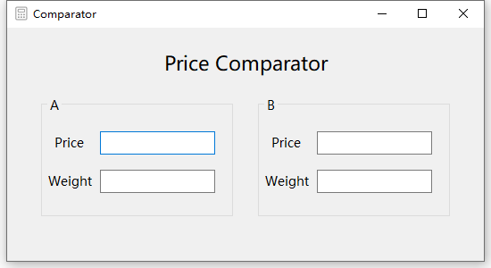

[English](./README_en.md) | 汉语

# Price Comparator

## 简介

一个简单的比较价格小工具。

## 环境

- 系统：Windows 10
- 应用程序：Visual Studio 2017
- 代码：C#

## 使用方法

复制项目文件到本机，使用 `Visual Studio` 打开 `Comparator.sln`。

或直接使用程序文件 `Comparator\bin\Debug\Comparator.exe`。

## 展示

## 许可证

MIT
