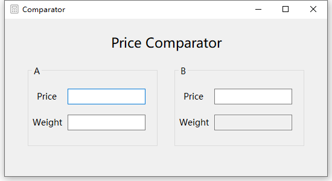

English | [Chinese](./README.md)

# Price Comparator

A simple price comparison tool.

## Environment

- System: Windows 10
- Application: Visual Studio 2017
- Code: C#

## Install

Copy this in own computer, using `Visual Studio` open `Comparator.sln`.

Or use program files directly `Comparator\bin\Debug\Comparator.exe`.

## Usage

- Enter the appropriate number in both price weight text boxes.
- Use the `Enter` key to switch modes.

## Display

## License

[MIT](LICENSE) © Funhuman
